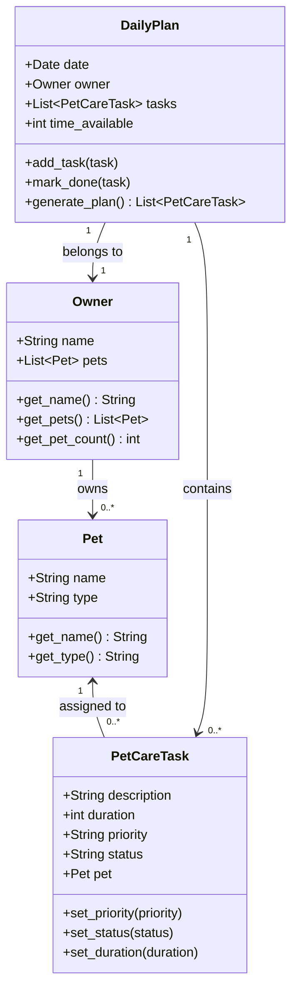

```mermaid
classDiagram
    class Owner {
        +String name
        +List~Pet~ pets
        +get_name() String
        +get_pets() List~Pet~
        +get_pet_count() int
    }

    class Pet {
        +String name
        +String type
        +get_name() String
        +get_type() String
    }

    class PetCareTask {
        +String description
        +int duration
        +String priority
        +String status
        +Pet pet
        +set_priority(priority)
        +set_status(status)
        +set_duration(duration)
    }

    class DailyPlan {
        +Date date
        +Owner owner
        +List~PetCareTask~ tasks
        +int time_available
        +add_task(task)
        +mark_done(task)
        +generate_plan() List~PetCareTask~
    }

    Owner "1" --> "0..*" Pet : owns
    Pet "1" <-- "0..*" PetCareTask : assigned to
    DailyPlan "1" --> "1" Owner : belongs to
    DailyPlan "1" --> "0..*" PetCareTask : contains
```
